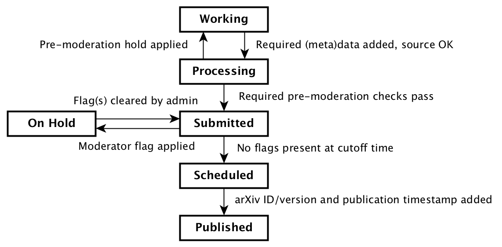

# arXiv Submission API service

The arXiv submission API supports programmatic submission mechanisms for
third-party applications.

## OpenAPI Schema

The [schema/](schema/) directory provides a description of the arXiv submission
API based on the OpenAPI 3.0.0 specification. The root API description is
located at [schema/openapi.yaml](api/openapi.yaml).

The OpenAPI description refers to [JSON Schema](json-schema.org) documents for
the various resources accepted/exposed by the submission API. Those schemas are
used to validate client requests and responses. **Note that OpenAPI 3 is a
subset of the JSON Schema specification**; we therefore only use keywords that
are supported by OpenAPI. [This
issue](https://github.com/OAI/OpenAPI-Specification/issues/333) provides
extensive background (scroll to the bottom for JSON Schema support in OpenAPI
3).

The OpenAPI and JSON Schema documents should be considered a contract for the
submission service API, and suitable as a basis for implementing clients.

## arXiv Submission & Publication Process

### arXiv Submissions & States

An arXiv submission is comprised of a source package and a collection of
procedural and descriptive metadata. The source package is usually comprised of
a scientific paper (generally in LaTeX) and auxiliary resources (e.g. images,
tables, errata); see ...

The primary objectives of the arXiv submission system are rapid dissemination
of scientific findings, and to support QA/QC workflows for arXiv's volunteer
moderators and the operations team. For a glimpse into how arXiv submissions
are processed on a daily basis, see [this recent blog
post](https://blogs.cornell.edu/arxiv/2018/01/19/a-day-in-the-life-of-the-arxiv-admin-team/).

In support of rapid dissemination, a core requirement for the submission
system is that the daily publication/announcement process should continue
even in the absence of human intervention. In other words, if the moderation
and operations teams were disbanded tomorrow, arXiv would continue to accept
and disseminate publications as usual.

At any given time, a submission will be in one of the states described below.

It should be noted that in the arXiv-NG submission system these states are
defined in terms of the the data that describes the submission, **not** by a
flag in the database.

Working
    When the submission process is initiated, it generally lacks some of the
    (meta)data and/or content required for publication. For example, the
    submission process may be initiated by sending preliminary information for
    only a few metadata fields, leaving the submission source package to be
    uploaded separately. Several users and/or API clients may be involved in
    contributing information about the submission. The source package must
    compile to a publishable PDF before a submission can leave the working
    state.

Processing
    Once a submission is finalized (ready for publication), it is subject to
    a handful of automated QA/QC checks. For example, we need to be able to
    extract plain text content from the compiled paper for subsequent checks.
    Depending on the results of those checks, the submission may be bounced
    back to the working state to correct problems. Generally, a submission
    remains in the processing state for a very short period of time (seconds or
    minutes).

Submitted
    If the preliminary checks pass, the submission is considered to be in the
    submitted state. Automated checks for technical issues may also be applied
    while the submission is in this state, and members of the moderation and
    operations teams may inspect the paper for quality or to address issues
    flagged by the technical checks. If a moderation flag is applied to the
    submission during this process, the submission transitions to the **On
    Hold** state (below). If no moderation or administrative flags are raised
    on the submission, the submission will automatically transition to the
    **Scheduled** state (below) at one of two cutoff times.

On Hold
    A submission in this state has been flagged by a moderator or by an
    automated QA/QC process for potential problems. Submissions in this state
    are usually inspected by the operations team, who may reach out to the
    submission owner. If and when the issues with the submission are resolved,
    an administrator will remove the blocking flags from the submission, and
    the submission will return to the **Submitted** state.

Scheduled
    Any submissions in the **Submitted** state at the publication cut-off time
    (currently 2PM ET) will be automatically scheduled for publication on the
    same day (currently 8PM ET). Any remaining submissions in the **Submitted**
    state at the next-day cutoff (currently 8PM ET) will be scheduled for
    publication on the following day.

Published
    The automated publication process runs daily, currently at 8PM ET. Any
    submissions scheduled for the current day will be updated with their
    arXiv ID and version, and a publication timestamp. At that time, the
    submission is considered **Published**. No further changes
    may be made to a submission in this state.
