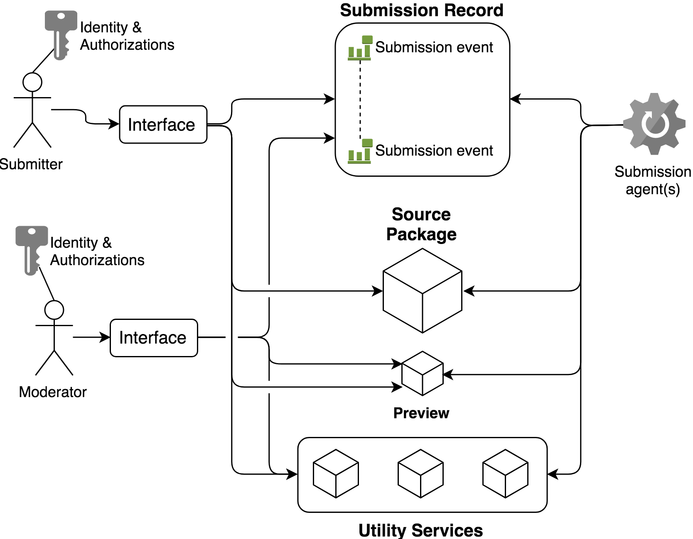
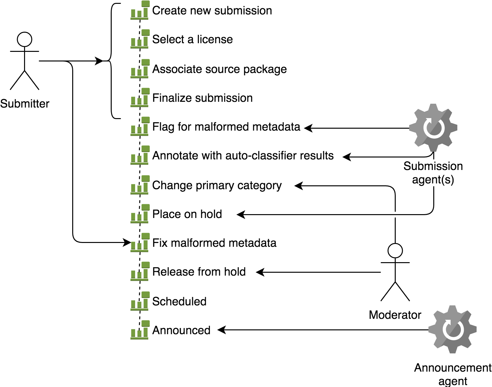
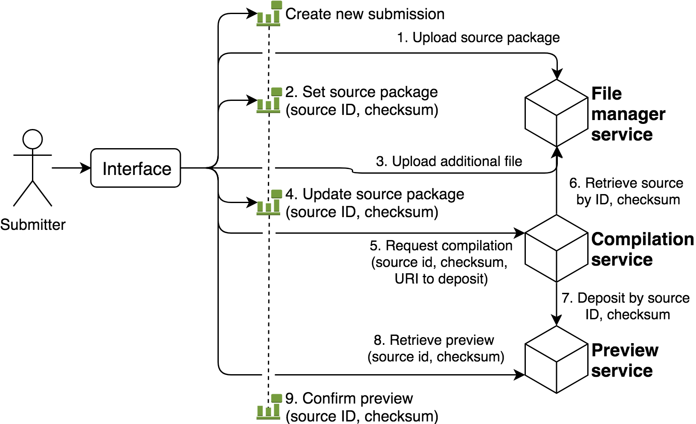
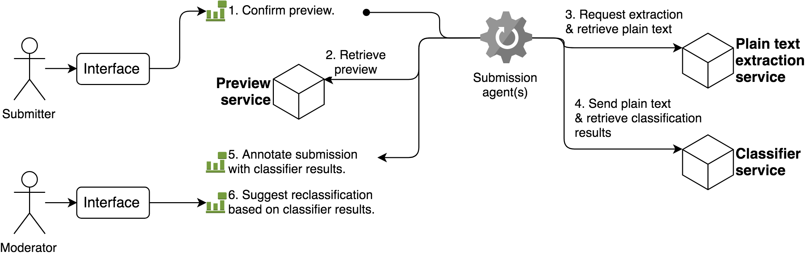
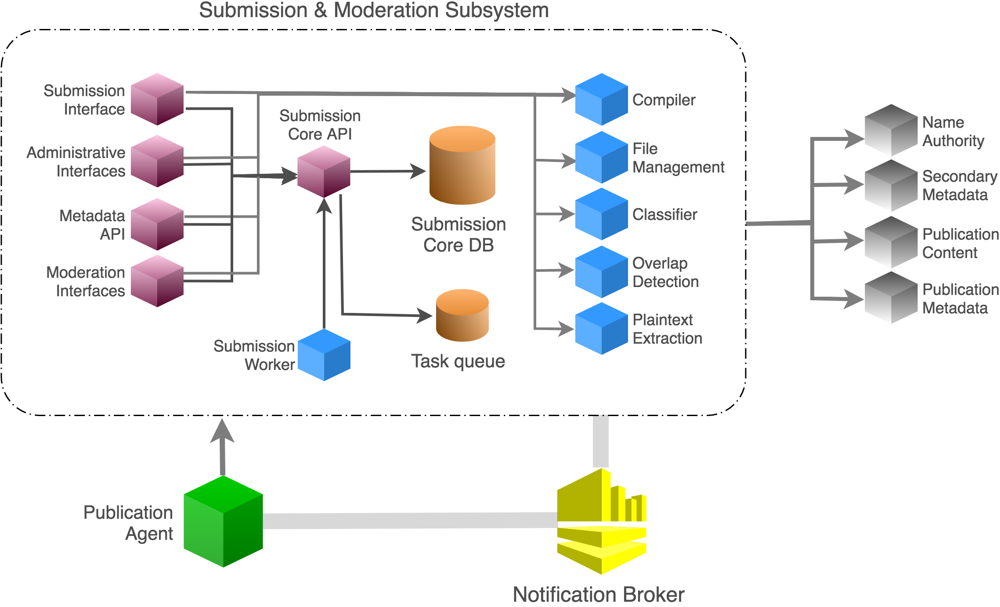
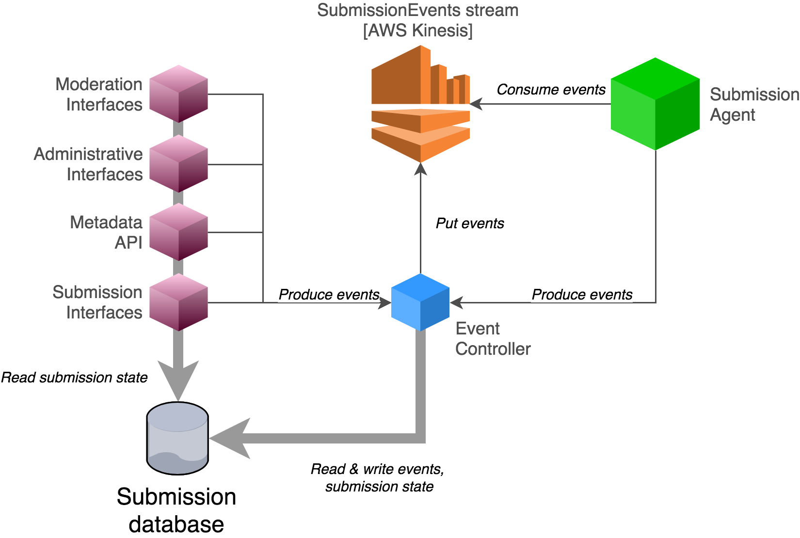

Submission subsystem architecture
*********************************

.. contents:: :depth: 3

Overview
========

The submission and moderation subsystem encompasses the applications,
data, and processes by which e-prints enter arXiv and are prepared for
announcement. The scope of this subsystem begins at the multiple
interfaces by which e-prints are submitted to arXiv, includes a
wide range of quality assurance and moderation activities, and ends at
the scheduling of an e-print for incorporation into
the canonical record and announcement to the public.

In the absence of moderator or administrator intervention, an e-print
will proceed automatically to scheduling and eventual announcement
provided that programmatic filters are passed. The arXiv submission
operates passively, like a series of filters. Some of those filters
are programmatic, and the submitter may be required to take several
actions to satisfy their parameters (e.g.  well-formed metadata,
usable TeX source). An additional layer of filtering occurs within the
context of moderation, where human moderators and administrators may
intervene on an e-print to block or delay its announcement (possibly
requiring further action by the submitter).

This is an intentional design decision so that the dissemination of
research continues in the absence of human intervention.

This is in contrast to journal publication where the procession of
work from submission to publication involves editors, reviewers and
others taking explicit action for a submission to make its way to
publication.

.. _figure-model:

   Working conceptual model of the arXiv submission subsystem.

The model of the submission used throughout the rest of this document is based
on the description above.

- The **submitter** is the primary human actor that holds the ultimate
  responsibility for the procession of their e-print to scheduling for
  announcement. Note that the submitter may or may not be an author of the
  e-print.
- A **submission** is a scientific text (e.g. a research article) accompanied
  by descriptive and procedural metadata that has been provided by a submitter
  for the purpose of announcing the work on the arXiv platform.
- **Submission interfaces** provide the means by which the submitter provides
  the required input (content, metadata, etc), and perform initial validation
  of the input.
- **Automated processes** implement quality assurance checks, as well as policy
  that goes beyond preliminary input validation. These checks may be configured
  by administrators, incorporate a wide range of contextual information (such
  as user identity, affiliation, and past behavior), and may annotate
  submissions to assist moderators and/or the submitter in identifying possible
  problems.
- **Moderators** have visibility onto submissions and the results of automated
  processes, and may intervene on submissions to implement moderation policies
  and/or require further intervention by the submitter. Moderators and
  administrators view and interact with submissions via moderation and
  administration interfaces.

Key requirements
----------------
Several key requirements emerged from the consultation and planning process
for arXiv NG:

1. The subsystem must sensibly incorporate input from, and synchronize the
   activities of, a variety of human and non-human agents.
2. It must be possible for administrators to audit all changes to submission
   state in the subsystem (e.g. by submitters, moderators, automated
   processes, etc).
3. Administrators must be able to configure automated rules and processes.
4. The subsystem must support future development of potentially many
   alternative interfaces for submission and moderation, including interfaces
   developed and operated by trusted third-parties.
5. The subsystem must be able to support a high volume of activity. We
   currently process around 11,000 submissions per month (early 2018),
   and expect that to grow at least 10% per year.  If each submission
   requires 1000 HTTP requests that is 11000*100/30*24*60*60 = 4.2
   HTTP requests per second. 
6. The subsystem must make it easier to support future operational and policy
   changes around submission content, quality assurance, metadata, and other
   areas of concern.

Solution strategy
-----------------
The classic arXiv submission system was implemented as a conventional
MVC-style web application (Perl/Catalyst framework) on top of a set of
abstractions that encapsulate database and filesystem access as well as
a variety of heuristics built up over time to handle new scenarios and
features. This has become increasingly difficult to extend further.

To address the key requirements enumerated above, the high-level architecture
for the NG submission subsystem is comprised of the following major parts:

1. **The core data architecture is built around a stream of submission-related
   events, which describe the mutations of a submission from its creation
   through announcement.** The event model is implemented in the :ref:`core
   submission package <submission-core-events-package>`, which handles storage
   of events, interoperability with the legacy data model, and propagation of
   events for consumption by other services in the submission subsystem. The
   event model captures the core domain logic of submissions, including input
   validation for each event type.
2. **Submission and moderation interfaces are implemented as independent
   applications that mutate submissions by generating events.** Interfaces
   perform basic input validation, e.g. by translating event model exceptions
   into informative messages, and disallowing invalid input.
3. **Automated policies and procedures are implemented in the :mod:`agent`.**
   This application listens to submission events, and carries out asynchronous
   processes that may further mutate submissions via events.
4. **Major functional components of the classic submission system are
   decomposed into independent :ref:`utility-services`**. These backend
   services are generally agnostic about the submissions themselves. This
   includes classification, overlap detection, compilation (TeX, PS), and
   upload/file management. These services may be invoked by the interfaces
   and/or agent as needed to carry out submission processes.

Model & drivers
===============
This section documents a working conceptual model of the arXiv submission
subsystem, focusing on the prevailing concerns and drivers that shape the
design of its technical components. The purpose of this section is to provide
a common frame of reference for project participants as questions about
policies, procedures, and system design arise.

.. contents::
   :depth: 2
   :local:

The submitter
-------------
The "submitter" refers to any actor that originates an e-print in the arXiv
submission subsystem. This includes:

- An author. The typical submitter is an author of a scientific work who
  intends to share that work with peers via the arXiv platform.
- A proxy for individual users, acting on behalf of an author. For example,
  submissions originating from large scientific collaborations may be provided
  to arXiv by support staff rather than authors.
- An editor of conference proceedings or other collections (i.e. a bulk proxy).
  Authorized conferences may deposit works from their proceedings in arXiv.
  This may occur through specialized web interfaces, or via APIs.
- An external platform acting on behalf of an individual author. In this
  case, the author will have granted explicit authorization to the platform
  via a three-legged OAuth2 workflow.

Each of these types of submitters will hold arXiv user accounts, be
authenticated with arXiv, and hold the required authorization(s). Examples of
required authorizations include:

- Endorsement to submit to a particular subject area within arXiv.
- Permission from arXiv to act as a bulk proxy, e.g. for conference
  proceedings.
- Permission from arXiv to provide an alternative interface for submission, and
  authorization from an arXiv user to submit to arXiv on their behalf.
- Permission from another arXiv user to submit to arXiv as their proxy.

Submitter concerns
^^^^^^^^^^^^^^^^^^
Depending on the context, submitters may hold a combination of several or all
of the following objectives:

1. Increase the visibility of research results within their field, discipline,
   or general public.
2. Obtain early feedback from scientific peers about preliminary research
   results, in order to try out new ideas and/or improve the quality of an
   eventual peer-reviewed paper.
3. Establish priority for a scientific idea.
4. Submit a paper for peer-review and publication in an overlay journal.
5. Make an accepted or published scientific paper freely available to readers.
6. Embed more ephemeral scientific outputs into the scientific record (e.g.
   conference papers).
7. Ensure long-term availability of scientific outputs (i.e. arXiv plays an
   archival function).

Submissions
-----------
A submission is an abstract object that arises from a collection of content
files (the "source package"), procedural and descriptive metadata, and
additional annotations generated by moderators, administrators, and automated
systems prior to announcement. A submission generally represents a single
scientific work, provided to arXiv for announcement and dissemination to
other researchers and for free public distribution.

Submission content and metadata are treated separately in the subsequent
sections.

Source package
--------------
The source package is a collection of files, such as a set of TeX sources,
images, and ancillary files, that comprise or will generate a scientific paper
for distribution. In the classic system, the source package and the submission
itself are tightly coupled, in that there is a one-to-one correspondance
between a submission and a source package. In the NG submission subsystem, the
source package is identified independently of submissions, in order to
facilitate more complex workflows.

A source package is identified by a numeric source identifier (or upload
identifier), and by a checksum of the package contents. Any service or process
that operates on a submission source package will do so in reference to both
the source identifier and the specific state (represented by the checksum) of
the source. This helps to ensure consistency when multiple systems or actors
are performing activities in reference to the source package, which may change
over time as files are added, amended, or removed.

Forms of submission content
^^^^^^^^^^^^^^^^^^^^^^^^^^^
Submitters provide content to arXiv in one of several forms.

The most common form is a TeX source package, containing sources for the
manuscript, bibliographic references, styles, images. Ancillary content, such
as data or other supporting materials.

Submitters may alternatively provide a finalized PDF. In limited cases (e.g.
conference proceedings indices) HTML-only submissions may be permitted. Other
content types may be supported in the future.

Accession of content during submission inevitably involves competing interests
of the submitter and other stakeholders.

The submitter...

- Wants to provide a manuscript in a form that is closest to what they will
  submit to a journal or conference.
- Wishes to minimize the amount of arXiv-specific tweaks and changes required.
- Wishes to include as much arbitrary ancillary content as they feel is
  appropriate to support their manuscript.
- Wants readers to see the manuscript in the same form that they do on their
  own computers. I.e. if their TeX source compiles a particular way on their
  own system, the submitter would prefer that it compile in the same way on
  arXiv.

Competing drivers include:

- The cost (in terms of testing, troubleshooting, documenting) of supporting
  third party add-ons and macros for TeX creates some lag between the general
  availability of new TeX features and support in arXiv. This means that we
  must be somewhat selective about what we support.
- The need to enforce content policies places some constraints on supportable
  file formats. For example, it is must be possible to extract plain text
  content from a submission.
- Future readers have an interest in the ability to generate additional content
  types. This interest is frequently cited as a driver for continuing to
  encourage (if not require) that submissions be made in TeX format.
- Readers have an interest in being able to obtain and read e-print content
  without road-blocks or delays. This puts constraints on the allowable size
  of e-prints, at least for the primary document that readers download.
- There are real costs associated with overall volume of content stored by
  arXiv. While these costs continue to come down, this continues to be a
  driver for limits on submission content size that cannot be wholly dismissed.
- Security considerations place some limits on the ability to allow certain
  file formats in submissions.
- Archival considerations call for the ability to ensure the long-term
  integrity of e-print content. This includes both the ability to ensure the
  bit-level integrity of submission files as well as the means of access to
  the content encoded therein. This may make some file formats less feasible
  to support than others.
- Researchers and platform developers have an interest in the ability to
  extract plain text content from e-prints, in order to perform text mining.
  While this concern ought not override strong concerns of submitters and
  readers around general consumption, it is not an unimportant consideration.

Decisions about the design and implementation of software to support the
accession and processing of content must take these and other drivers into
account.

Handling of submission content
^^^^^^^^^^^^^^^^^^^^^^^^^^^^^^

Handling of **submission content** is generally separated into three distinct
activities, which may take place independently of the submission itself.

1. Upload/transfer of submission content files.
2. Processing of submission content.
3. Confirmation of the submission content as it will be displayed to readers.

Uploads
"""""""
Uploading/transfer of the source package is the domain of the file management
service. It involves accepting, versioning, sanitizing, and checking source
files for suitability for processing and ultimate announcement. The lifecycle
of a submission source package begins when a new upload workspace is created
in the file management service and a new unique source ID is assigned.
Submission source packages are generally retained so long as they are
associated with a submission that has not yet been announced.

Every modification of the source package results in a new checksum, and
therefore a new "version" of the source package. Submissions refer to source
packages by both their unique source ID and a checksum, and subsequent
operations involving content will always refer to the checksum in order to
prevent inconsistencies.

Processing
""""""""""
Processing of the source package encompasses any transformations of the content
that are required to generate the final representation of the work as it will
be distributed to readers. The canonical example is processing of TeX sources
to generate a PDF, using the compiler service. For non-TeX submissions,
processing may simply involve the verification of the required file(s) in the
source package.

The end result of processing should be the existance of a readable product
(currently, a PDF) that can be previewed by the submitter. The preview is
housed by the submission preview service. Interfaces that implement a
submission workflow **must** orchestrate processing, including deposition of
the preview.

Confirmation
""""""""""""
Confirmation encompasses the display of the final preview of the submission
to the submitter, and a positive affirmation by the submitter that the preview
is acceptable.

Two considerations are especially pertinent here:

1. The preview must be substantially identical to what readers will see after
   the work is announced. Small differences (e.g. watermarks) may exist, but
   the typesetting, figures, references, and other aspects of the display of
   the content must be indistinguishable from the eventual announced version.
2. In most cases, an explicit positive affirmation that the submitter has
   viewed and is satisfied with the preview should be obtained. This may not
   always be possible or appropriate, e.g. in the context of bulk proxy
   submissions. In the case that the submitter is an external platform acting
   on behalf of an individual arXiv user, the platform should be expected to
   guarantee that the user has viewed and affirmed the preview.

Affirmation of the preview is commemorated as an event in the submission
record (below).

Submission record
-----------------
The submission record is a complex object that represents a scientific work to
be announced on arXiv. The submission record is identified by a unique numeric
ID, and refers to a source package in the arXiv submission subsystem by source
ID and checksum. During announcement, the submission record and its associated
source package are incorporated as an e-print into the arXiv canonical record.

The classic system tracked information about a submission using an
object-oriented data model in which the submission is represented by a
collection of related entries in database tables. The advantage of such a
representation is that it fits naturally into an object-oriented programming
paradigm, and is a well-understood pattern for web application development.
The downside of that approach is that coordinating activity among many actors
operating on a single submission at the same time can become unweildy,
difficult to audit, and difficult to extend.

.. _figure-submission-record:

   The arXiv NG event-based submission record. Actors intervene on submission
   state by generating new submission events, which together describe the
   complete state of the submission.

The primary representation of a submission in the NG submission subsystem is a
**series of events that describe all of the changes that have occurred to that
submission, starting with its creation**. An event is comprised of some input
data, such as input from the submitter, and an event type, which describes how
those data are applied to the prior state of the submission to generate its
subsequent state. The current state of the submission can be generated by
"playing" those events in order from the beginning. Actors and systems
intervene on submissions by generating new events, and may monitor submission
activity by subscribing to and selectively processing those events.

Associated submission content
^^^^^^^^^^^^^^^^^^^^^^^^^^^^^
A submission is linked to its content by a reference to the identifer and
checksum of a source package, usually housed by the file management service.
Submission events are used to set and update that identifier and checksum.
This may occur simultaneous to upload and modification of the source package,
or subsequent to it.

In addition, affirmation of the submission preview (if required) is
commemorated via a submission event.

In order for a submission to be finalized, scheduled, and eventually announced,
it must:

- Refer to a source package, and the checksum recorded in the submission record
  must match the current checksum of the source package upon retrieval.
- Refer to a submission preview,

Submission interfaces
---------------------
The purpose of each submission interface is to support the activities of a
submitter as they move their e-print through the arXiv submission process. This
encompasses "initial" submission activities, such as entering metadata and
updloading content, as well as subsequent steps required for successful
announcement of their e-print.

Current submission interfaces include:

- The submission user interface, which supports authors and author-proxies
  submitting e-prints one at a time.
- The SWORDv1 API, which supports editors of conference proceedings and other
  collections who deposit e-prints in bulk. **This interface is slated for
  deprecation in the near future.**
- The submission API, which supports programmatic deposit of e-prints. This
  supports external platforms submitting on behalf of individual authors,
  and will also support programmatic bulk (proxy) deposit currently handled by
  the SWORDv1 API.

Additional interfaces may be introduced in the future, as distinct use-cases
and/or submitter personas emerge.

From a submitter's perspective, there are three principal areas of concern at
both the time of initial submission and in subsequent actions prior to
scheduling and announcement.

1. Procedural metadata, such as licensing, affirmation of terms.
2. Descriptive metadata, such as the title, abstract, author names.
3. Content, including both source files and the rendered product (e.g. PDF).

Each arXiv submission interface must deal with each of these three aspects of
the submission in one way or another.

Procedural metadata
^^^^^^^^^^^^^^^^^^^
Procedural metadata are information about an e-print that exist primarily to
facilitate announcement and dissemination by arXiv, rather than describing
the content of the e-print per se. This includes:

- Positive affirmation by the submitter of arXiv's submission policies.
- Selection of a distribution license for the work.
- Attestation of authorship, or of permission to submit as a proxy for an
  author.

These metadata exist first and foremost to address the operational and policy
concerns of arXiv, and only secondarily to address the concerns of the
submitter.

These metadata may or may not require explicit input from the submitter. For
example, submitters who are authors may select a distribution license
explicitly at the time that they create a submission, whereas a bulk proxy
submitter may have pre-selected a distribution license that is applied
implicitly to all of their submissions.

Descriptive metadata
^^^^^^^^^^^^^^^^^^^^
These metadata will almost always require input from a submitter for each
e-print that is provided. Interfaces may collect these metadata as deemed
appropriate for the use-cases that they support, and implement whatever means
are necessary to translate those input into the corresponding submission events
behind the scenes.

Orchestrating submission content workflows
^^^^^^^^^^^^^^^^^^^^^^^^^^^^^^^^^^^^^^^^^^
In order for a submission to be scheduled and announced:

1. The submission must have an **associated source package**, indicated by an
   identifier and checksum. In the current implementation, the identifier is a
   numeric ID generated by the file manager service. Possible future extensions
   might use an URI, to allow for submission by reference to an external
   resource.
2. The **checksum indicated in the submission record must match the current
   state of the source package**.
3. The submission have have a **confirmed preview**, indicated by a source
   identifier, source checksum, and preview checksum. This preview must be
   available via the submission preview service.

Beyond those requirements, the specific means by which this state is achieved
are not tightly constrained. For example, an interface might orchestrate all
source content-related activities (upload, modification, processing, preview)
prior to the creation of the submission record itself. Or, as in the example
below, upload and processing steps may be interleaved with other steps in
the submission process.

.. _figure-submission-upload:

   Example of submission content workflow for a compiled format (e.g. TeX). The
   submission interface proxies the initial upload of the source package to the
   file manager service (1), and associates the source package with the
   submission (2). A subsequent upload is proxied to the file manager service
   resulting in a new checksum (3); the interface associates this new checksum
   with the submission (4). The submitter triggers processing via the
   interface, which requests compilation of a specific source ID and checksum,
   and requests that the result be deposited to the preview service (5). The
   compiler service uses the source ID and checksum to retrieve the correct
   source from the file manager service (6). The compilation service deposits
   the successfully processed preview to the preview service (7). The interface
   retrieves the preview to show the submitter (8), and then confirms the
   suitability of the preview as indicated by the submitter (9).

Moreover, the upload, processing (e.g. compilation), and preview requests need
not be facilitated or proxied by an interface. The underlying services may be
directly exposed to client requests via the API gateway. Note that an
interface would still be required to generate the appropriate submission events
to associate the source package and preview resources with the submission
itself.

.. _submission-agent:

The submission agent
--------------------
The :mod:`agent` orchestrates backend processes based on rules triggered by
submission events.

The primary concerns of the agent are:

- Orchestrating automated processes in support of submission and moderation.
- Keeping track of what processes have been carried out on a submission, and
  the outcomes of those processes.
- Providing a framework for defining conditions under which processes should be
  carried out.

The submission subsystem implements a wide range of quality assurance checks
and other automated actions on submissions. Most of these checks are too
unweildy to perform within the context of a submitter/client HTTP request.
Moreover, in almost all cases it is important to guarantee that required checks
and processes have taken place for all submissions; leaving this responsibility
up to various submission interfaces introduces unacceptable complexity and
unpredictability.

.. _figure-submission-agent:

   **Example of an automated process carried out by the submission agent.** The
   submission agent consumes an submission preview confirmation event generated
   by a submission interface upon affirmation by the submitter (1). The
   submission agent applies rules that are configured by arXiv administrators,
   which indicate that a multi-step classification process should be carried
   out. This involves first retrieving the PDF preview (2), requesting plain
   text extraction from the PDF (3), requesting classification suggestions
   based on the plain text (4), and then annotating the submission (via an
   another event) with the classification results (5). A moderator may then use
   those results as the basis for a suggestion to reclassify a submission (6).

The submission agent is responsible for orchestrating quality assurance checks
and other automated actions in response to submission events. It monitors all
submission events generated by interfaces, and applies configurable rules and
policies to those events to determine what actions (if any) must be performed.
Processes are carried out asynchronously, and may generate additional
submission events.

Examples of activities orchestrated by the submission agent include:

- Enforcing size limits by applying flags and/or holds to submissions with
  oversize source packages.
- Extracting plain text from submission previews, invoking the auto-classifier
  service to identify possible mis-classification, and using the results to
  generate proposals (as events) for reclassifying a submission.
- Checking for possible textual overlap between submissions, to catch possible
  duplicates.

Note that it is not necessary for all policies and procedures to be implemented
in just one such agent. As policies and processes for various arXiv
classification domains evolve, for example, it may be desirable to introduce
several such agents responsible for different domains. Many other divisions of
concerns are conceivable, and at this time there is no limitation on or
prescription for how agents are apportioned responsibilities.

Moderators & moderator interfaces
---------------------------------
Over 160 `volunteer moderators <https://arxiv.org/moderators/>`_ monitor the
stream of submissions that flow through their particular subject area on a
daily basis. An overview of arXiv moderation system can be found `on the
arXiv help site <https://arxiv.org/help/moderation>`_. Moderators screen
submissions for content that does not appear to be appropriate for announcement
on arXiv, and may take a variety of actions in support of that goal. This may
include:

- Proposing reclassification of submissions.
- Place a submission on hold.
- Annotating the submission.

Typical workflow
----------------
Submitters (and external services) generate new submissions, which are
comprised of metadata and a content object (e.g. a tar/gzipped TeX source
bundle, or a single PDF file). Prior to consideration by moderators,
submissions may undergo several rounds of modification. Submitters may revise
metadata and/or upload revised content. During this process a handful of
different services may need to operate on the submission. For example,
the content is compiled into an arXiv PDF; links are extracted
for consideration by the submitter; etc.

Upon submission, the paper may be subject to a variety of processing and
moderation activities. Automatic classification algorithms may be run, which
require pre-processing steps (e.g. plain text extraction). Moderators may
propose re-classification, act on input from classification algorithms, make
comments, etc. Depending on moderator activity, additional input from the
submitter and/or administrators may be necessary.

Context
=======

This section describes the context for the submission system.

.. _figure-submission-context:

.. figure:: _static/diagrams/submission-context.png
   :width: 600px

   System context for the arXiv submission system.

Authenticated users
-------------------
Authenticated users submit new e-prints via a user interface. Users can
view the status of their submissions, which may include feedback from
administrators, and amend their submissions as necessary. They
can also view a preview of their submission, and make amendments to the source
files in their submission directly via the interface. Authors can supplement
their announced and unannounced e-prints with links to external resources.

Moderators (authenticated users with a moderator role) screen and curate
submissions through a moderation interface. They can generate comments, flags,
proposals, and other annotations attached to submissions.

Administrators can audit and manage the submission platform, including the
behavior of automated processes and policies, through an administrative
interface.

API access
----------
All API access passes through the arXiv API gateway.

The submission system provides a RESTful API for programmatic use. Clients may
deposit submissions in bulk (e.g. conference proceedings), or on an individual
basis on behalf of arXiv users. Authenticated arXiv users must explicitly
authorize external API clients to deposit on their behalf. The submission
system offers a web-hook notification service that pushes updates in
submission state to authorized API clients.

A variety of backend services are exposed via the API gateway, including
the file management system (to facilitate upload), compilation services,
and classification services. Access to those services must be explicitly
authorized by administrators.

Other arXiv services
--------------------
During the daily announcement process, the :ref:`announcement-agent` retrieves
information about announcement-ready submissions. The announcement agent moves
submission content and metadata into the appropriate storage facilities,
transitions the state of announced e-prints, and triggers downstream
processes via the notification broker.

Some processes in the submission system require information about past
arXiv papers. For example, classification, overlap detection, and other
QA/QC services will keep themselves up to date by consuming metadata and
content from announced e-prints in the canonical record.

Services & building blocks
==========================

The submission & moderation subsystem is comprised of the following parts:

1. The :ref:`submission-database`, which houses a detailed record of
   submission data events and projections.
2. A collection of submission, moderation, and administrative
   :ref:`interface-services`. These include form-based user interfaces and
   RESTful APIs for external users/clients. Those interfaces interact with the
   core database via a shared library, which guarantees consistent mutations
   of submission data and application of business logic/rules.
3. A collection of :ref:`utility-services`, including services for compiling
   submissions to PDF, sanitizing uploads, and automated classification.
4. The :ref:`submission-agent`, which monitors submission events and runs
   backend processes (such as QA checks) based on a set of configurable rules.
5. A :ref:`web-hook-service` that disseminates submission-related events
   to authorized clients via HTTP requests.

.. _figure-submission-services:

   Services in the arXiv submission subsystem.

.. _submission-database:

Submission database
-------------------
The submission database (currently MySQL) is responsible for the persistence of
operational and core descriptive metadata about submissions. Operational
metadata includes information related to arXiv workflows and processes. Core
descriptive metadata are the core metadata fields required for
arXiv submissions (e.g. title, authors, abstract). The primary source of truth
for the state of each submission is a set of transformation events. Derivative
representations (e.g. of submission objects) are also stored for querying and
rapid access.

In early phases of the classic renewal process, this will be the classic MySQL
database running in the CUL-IT datacenter. During the arXiv-NG project,
submission data will be migrated to a standalone MariaDB or PostgresQL cluster
in AWS RDS.

.. _submission-core-events-package:

Submission core package
-----------------------
This package provides an event-based Python API for mutating submissions, and
is the *only* mechanism for writing submission data to the
:ref:`submission-database`. This package is used by both the
:ref:`interface-services` and the :ref:`submission-agent`.

- Provides a set of commands (events) that canonicalize operations on
  submissions, and are used as the basis for composing rule-based processing
  tasks for quality control.
- Provides service integration modules for working with utility services (e.g.
  :ref:`utility-services`)
- Provides integration with a notification broker (Kinesis) for disseminating
  events to other parts of the system (e.g. :ref:`submission-agent`).

Detailed package documentation can be found in :mod:`arxiv.submission`.

.. _interface-services:

Core interface services
-----------------------
These services provide the core submission, moderation, and administrative
interfaces for the arXiv submission subsystem. Each of these services integrates
with the :ref:`submission-database` to modify submission state, via the
:ref:`submission-core-events-package`.

These core interface services integrate with other services in the submission
subsystem (e.g. file management service, compilation service) via
their HTTP APIs.

.. _submission-ui:

Submission UI
^^^^^^^^^^^^^
https://github.com/cul-it/arxiv-submission-ui

Provides form-based views that allow users to create and update submissions,
and track the state of their submission through the moderation and announcement
process. The interface supports metadata entry, source package upload, and
integrates with the compilation service to assist the submitter in
preparing an announcement-ready submission package.

Uses the :ref:`submission-core-events-package` to update submission state in
the :ref:`submission-database`.

Submission API service
^^^^^^^^^^^^^^^^^^^^^^
https://github.com/cul-it/arxiv-submission-core/tree/master/metadata

Provides a RESTful API for trusted clients to facilitate submission to arXiv
via external/third-party user interfaces.  Uses the
:ref:`submission-core-events-package` to update submission state in the
:ref:`submission-database`.

This will replace the existing `arXiv SWORDv1 API
<https://arxiv.org/help/submit_sword>`_.

Moderation UI service
^^^^^^^^^^^^^^^^^^^^^
Supports moderator actions on submissions. Comprised of a client-side
application (implemented in `React <https://reactjs.org/>`_) backed by a
lightweight Flask service. Uses the
:ref:`submission-core-events-package` to update submission state in the
:ref:`submission-database`.

Administrative UI service
^^^^^^^^^^^^^^^^^^^^^^^^^
The administrator interfaces provides visibility onto all parts of the
submission service, including the state and event history of all submissions
and submission annotations in the system. Administrators are able to configure
automated policies and processes, intervene on submission content and metadata,
and act on moderator proposals and comments.

.. _utility-services:

Utility services
----------------
The following utility services support the submission and moderation workflow,
providing a menu of functionality used by UI and API services to support
accession and quality assurance.

.. _file-management-service:

File management service
^^^^^^^^^^^^^^^^^^^^^^^
https://github.com/cul-it/arxiv-filemanager

This service is responsible for ensuring the safety and suitability of files
uploaded to the submission subsystem. The file management service accepts
uploads, performs verification and sanitization, and makes the upload available
for use by other services.

During on-premises deployment, the file management service is backed by an
SFS volume provided by Cornell IT. Upon migration to the cloud, the file
management service will be backed by an EFS volume.

.. _compilation-service:

Compilation service
^^^^^^^^^^^^^^^^^^^
https://github.com/cul-it/arxiv-converter

The build service compiles sanitized upload packages into PDF, PostScript,
and other formats. This service encompasses the arXiv TeX tree. Compilation
logs are also made available, for example to provide submitters feedback about
compilation failures or warnings.

The compilation service is backed by an AWS S3 bucket.

.. _plain-text-extraction-service:

Plain text extraction service
^^^^^^^^^^^^^^^^^^^^^^^^^^^^^
https://github.com/cul-it/arxiv-fulltext

Extracts plain text content from PDFs, for use by the for overlap detection
and classification services. Makes both raw extracted text and normalized
"PSV" tokenized text available to other services.

.. _overlap-detection-service:

Overlap detection service
^^^^^^^^^^^^^^^^^^^^^^^^^
https://github.com/cul-it/arxiv-docsim

Operates on extracted plain text content and submission metadata to
detect possibly duplicate submissions. Returns an array of announced e-prints
with a high degree of overlap.

.. _classifier-service:

Classifier service
^^^^^^^^^^^^^^^^^^
https://github.com/cul-it/arxiv-classifier

Operates on extracted plain text content and submission metadata to
propose categories for submitted papers.

Notification service
^^^^^^^^^^^^^^^^^^^^
Responsible for dispatching email notifications to submitters, moderators,
in response to submission subsystem events. Provides UIs for end-user and
administrator configuration.

.. _web-hook-service:

Web-hook notification service
-----------------------------
Provides mechanisms for API clients to register callbacks for submission
events. Event consumer is implemented using the Kinesis Consumer Library and
MultiLangDaemon [refs].

Example: integration with the auto-classifier
=============================================
When a user finalizes their submission for announcement, we perform a variety
of automated quality assurance checks to support the moderation process. This
example illustrates how classification-related checks are implemented in the NG
submission architecture.

1. The submitter finalizes their submission via the submission UI. This
   may involve a POST request, including a field attesting to the submitter's
   intent.
2. The submission UI generates a :class:`.FinalizeSubmission` event using
   :mod:`arxiv.submission`, persisting the event in the classic database and
   emitting the event on the ``SubmissionEvents`` Kinesis stream.
3. The :ref:`submission-agent` observes the :class:`.FinalizeSubmission` event
   on the ``SubmissionEvents`` Kinesis stream. This matches a rule that
   triggers the :class:`agent.process.RunAutoclassifier` process.

Open problems/future development
================================

The current implementation of the :ref:`core submission package
<submission-core-events-package>` is a step toward an event-sourcing framework
for the submission system. One of the core concepts of event-sourcing is that
we are able to generate the current state of an object (in this case, a
submission) from all of the events that have occurred. Until we are able to
jettison legacy submission components, however, this will not be true: legacy
components will make direct mutations to rows in the legacy submission
database without generating events. Those changes must be inferred, which is
achieved in :mod:`arxiv.submission.services.classic.interpolate`.

A related problem is avoiding race conditions on the event stream. We must
take care not to persist events that are inconsistent with the current state
of the submission. In the long run, we will achieve this via an
optimistic lock, e.g. by versioning the state of the submission and including
the expected version with an event that we wish to persist. This will entail
placing an event controller between event-generating applications and the
event store, which will reject events for which there is a version mismatch.
Since (as above) we are continuing to deal with legacy components that make
direct writes to submission state, in the interim we will rely on the atomic
transactions afforded by the legacy MySQL database, and ensure consistency
by creating a short-lived shared lock on related submission rows while
committing new events.

Finally, we ultimately want to avoid placing the responsibility for updating
the projected submission state on the applications that are generating events.
This is not possible in the short term for the reasons outlined above.
Currently, the event-generating application must read the submission state and
events from the legacy database, write both events and submission state to  the
legacy database, and propagate events via the event stream. This is handled by
:func:`arxiv.submission.core.save`\, and is implemented in a way that
preserves the ACIDity of the write.

.. _figure-submission-events-interim:

.. figure:: _static/diagrams/submission-events-interim.png
   :width: 600px

   Current implementation of submission events in the submission system,
   constrained by support for legacy integrations with the database.
   Applications that produce events must handle persistence (including
   consistency checks), updating the submission state, and propagating event
   notifications.

Once those constraints are lifted, however, applications generating events
should only be reading the submission state from the/a submission database, and
writing events to the event stream (e.g. by putting them to the event
controller).

.. _figure-submission-events-goals:

   Eventual implementation of submission events in the submission system,
   when legacy integrations with the database are no longer required. An
   event controller service assumes responsibility for ensuring the consistency
   of events, persisting/propagating the event stream, and updating the read
   database. All other applications use the database for reads only, and
   produce events via the event controller.
